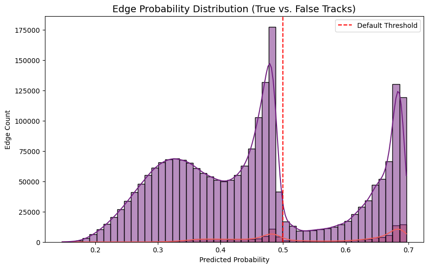
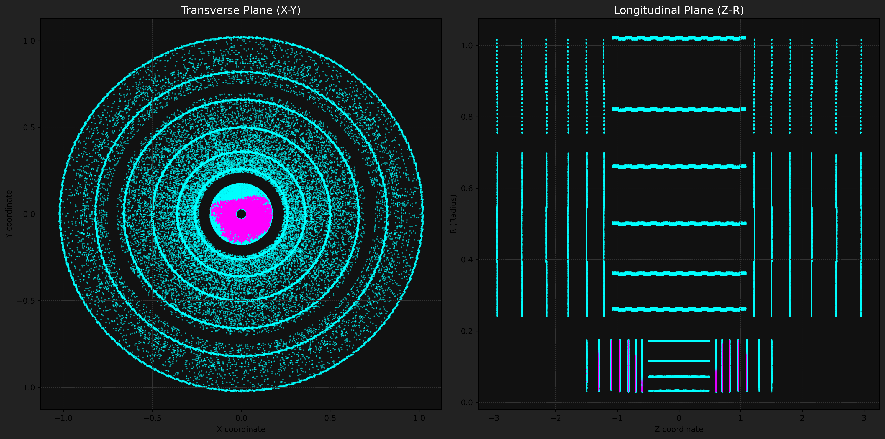

# TrackML Particle Identification with Graph Neural Networks


This repository contains a complete, end-to-end deep learning pipeline for High-Energy Physics (HEP) particle tracking. It utilizes a custom Message-Passing Graph Neural Network (GNN) combined with DBSCAN density clustering to reconstruct particle trajectories from 3D spatial hits in the ATLAS detector.

## Project Overview

In high-luminosity environments like the Large Hadron Collider (LHC), reconstructing particle tracks from millions of independent sensor hits is an immense combinatorial challenge. This project solves the tracking problem by treating it as an **edge classification task** on a spatial graph.

### The Pipeline:

1. **Graph Construction:** Raw 3D hits are normalized and converted into spatial graphs using a $k$-Nearest Neighbors ($k=10$) approach based on KDTree.
2. **Message Passing GNN:** A PyTorch-based neural network passes messages between nodes and edges, using `GroupNorm` and `OneCycleLR` scheduling to learn true physical connections.
3. **Density Clustering:** `scipy.sparse` matrices and `sklearn`'s DBSCAN algorithm group highly probable edges into final physical tracks.

## Architecture Highlights

### Graph Neural Network
The core model consists of an `EdgeModel` and a `NodeModel`. Edge features (distance and spatial deltas) are embedded, passed to the connected nodes, and aggregated. The updated node states are then used to predict a final binary classification for every edge (True Track vs. False Connection).

### DBSCAN & Noise Remapping
To extract discrete tracks from the GNN's continuous edge probabilities, we apply DBSCAN clustering. A critical post-processing step ensures that background noise (which DBSCAN inherently labels as `-1`) is not grouped into a massive, unphysical "super-cluster". Every noise hit is iteratively reassigned to a unique track ID:

```python
# Extract initial clusters based on GNN edge weights
dbscan = DBSCAN(eps=0.05, min_samples=2, metric='precomputed')
labels = dbscan.fit_predict(adj_matrix)

# Remap all -1 noise labels to unique individual IDs
max_label = labels.max()
for i in range(len(labels)):
    if labels[i] == -1:
        max_label += 1
        labels[i] = max_label
```

## Visualizations & Diagnostics

### Edge Probability Distribution
The GNN successfully separates true physical tracks from random combinatorial noise. The bimodal distribution clearly shows the model's high confidence.



### 2D Detector Projections
Visualizing the predicted tracks mapped across the Transverse (X-Y) and Longitudinal (Z-R) planes of the detector.



### 3D Track Rendering
The pipeline outputs an interactive Plotly HTML file (`3d_tracks.html` / `3d_clustered_submission.html`) allowing for full 3D manipulation and inspection of the reconstructed particle trajectories.

## How to Run

1. **Install Requirements:**
   ```bash
   pip install -r requirements.txt
   ```
2. **Hardware:** A GPU (NVIDIA T4/P100 or better) is highly recommended for the Message Passing training phase.
3. **Execution:** Run the `trackml-gnn.ipynb` notebook end-to-end. The pipeline will automatically extract the dataset, train the GNN for 50 epochs, evaluate the optimal F1 threshold, and generate the final `submission.csv`.

---
*Engineered with PyTorch Geometric.*